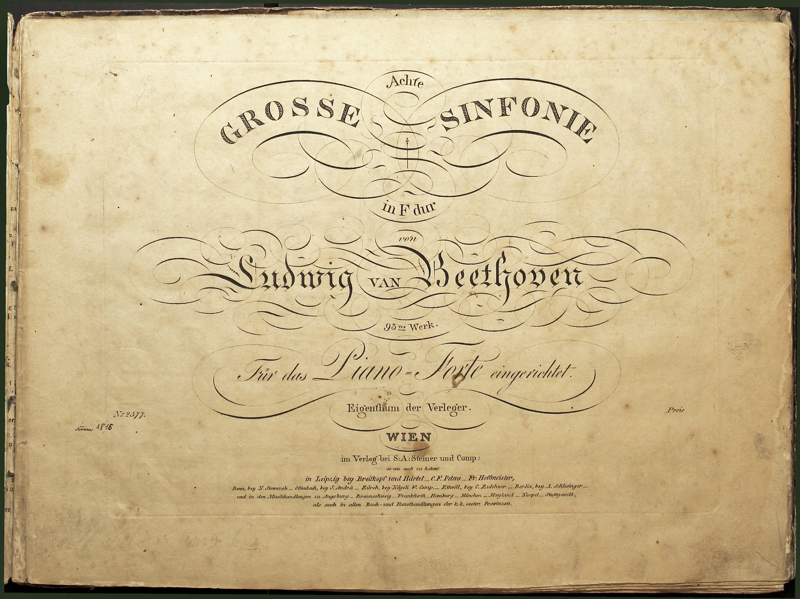

---
# Feel free to add content and custom Front Matter to this file.
# To modify the layout, see https://jekyllrb.com/docs/themes/#overriding-theme-defaults

layout: home
title: Home
---

<!-- <body style="background-color:rgba(255,243,176,0.6)"></body> -->

<!-- Red background:  -->
<!-- <body style="background-color:rgb(158,42,43)"></body> -->

{:height="500px" width="660px"}

# **Beethoven in the House**

## A 21st century study of 19th century publishing.
